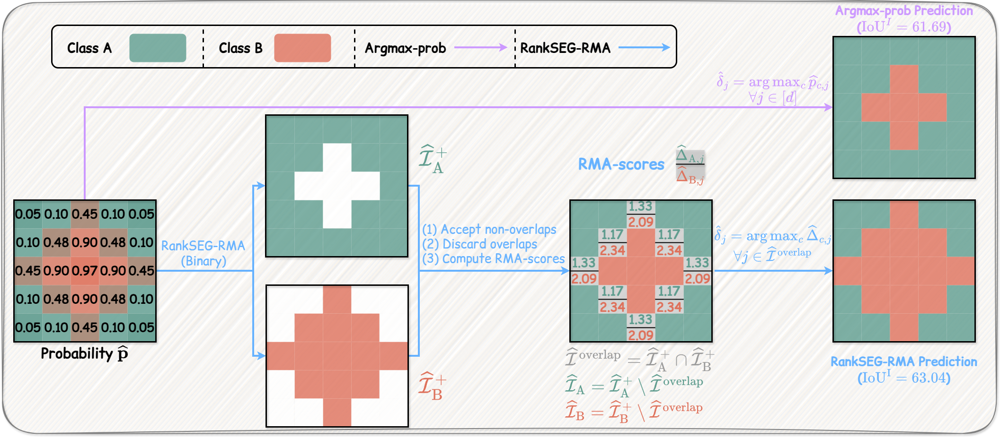

<h1 align="center"> <em>RankSEG-RMA: An Efficient Segmentation Algorithm via Reciprocal Moment Approximation </em></h1>



## Highlights

In semantic segmentation, most existing methods estimate pixel-wise class probabilities, then apply *argmax* or *thresholding* to obtain the final prediction. A recent work by Dai and Li (2023) has shown these methods are suboptimal in Dice/IoU, and proposed the RankSEG algorithm to directly optimize Dice/IoU. 

In this work, we accelerate the original RankSEG algorithm by proposing a reciprocal moment approximation (RMA). RankSEG-RMA achieves a significant speedup while maintaining the superiority of the original RankSEG algorithm. The effectiveness is demonstrated on various datasets and models.

## Usage

We propose the `rankseg_rma` algorithm to replace the existing `argmax` operation by directly optimizing Dice/IoU. The algorithm takes a probability map as input and outputs a segmentation result. The implementation is in [rankseg_rma.py](exp/rankseg_rma.py). The function can be easily integrated into existing pipelines with just one line of code.

```python
# prob: [batch_size, num_classes, height, width]
# Existing method: pred = prob.argmax(dim=1)

from rankseg_rma import rankseg_rma
pred = rankseg_rma(prob)
```

## Experiments

### Data Preparation

See [DATA.md](DATA.md) for detailed instructions on preparing datasets (PASCAL VOC, Cityscapes, ADE20K, LiTS, KiTS).

### Training and Evaluations

```bash
cd exp

# Step 1: Train a model with cross-entropy loss and evaluate with standard `argmax` prediction
torchrun \
    --nnodes=1 --nproc_per_node=4 --node_rank=0 --master_port=12345 \
    main.py \
        --data_dir "/path/to/data" \
        --output_dir "/path/to/output" \
        --model_yaml "upernet_convnext_base.fb_in22k_ft_in1k_384" \
        --data_yaml "pascal_voc" \
        --loss_yaml "ce" \
        --schedule_yaml "40k_iters" \
        --optim_yaml "adamw_lr6e-5" \
        --test_yaml "test_iou" \
        --predict_yaml "argmax"

# Step 2: Re-evaluate the trained model with `rankseg_rma` prediction
python main.py \
    --data_dir "/path/to/data" \
    --output_dir "/path/to/output" \
    --model_yaml "upernet_convnext_base.fb_in22k_ft_in1k_384" \
    --data_yaml "pascal_voc" \
    --loss_yaml "ce" \
    --schedule_yaml "40k_iters" \
    --optim_yaml "adamw_lr6e-5" \
    --test_yaml "test_iou" \
    --predict_yaml "rankseg_rma" \
    --test-only
```

### Performance Comparison

We present a subset of our main results evaluated by mIoU<sup>I</sup>. Complete experimental results and analysis can be found in our paper.

#### Natural Image Dataset

| Model | Prediction | ADE20K | Cityscapes | Pascal VOC |
| --- | --- | --- | --- | --- |
| SegFormer | Argmax | 54.09 | 73.32 | 86.86 |
| SegFormer | RankSEG-RMA | **54.72** (+0.63) | **74.10** (+0.78) | **87.28** (+0.42) |
| UPerNet | Argmax | 56.94 | 75.66 | 87.82 |
| UPerNet | RankSEG-RMA | **57.67** (+0.73) | **76.17** (+0.51) | **88.25** (+0.43) |

#### Medical Dataset

| Model | Prediction | LiTS | KiTS |
| --- | --- | --- | --- |
| DeepLabV3+ | Argmax | 38.45 | 61.16 |
| DeepLabV3+ | RankSEG-RMA | **40.09** (+1.64) | **63.56** (+2.40) |
| UNet | Argmax | 38.45 | 47.58 |
| UNet | RankSEG-RMA | **40.70** (+2.25) | **50.07** (+2.49) |

*RankSEG-RMA consistently outperforms argmax prediction across all models and datasets.*

## Acknowledgements

The experiment codebase is built upon [JDTLosses](https://github.com/zifuwanggg/JDTLosses). We thank the authors for their great work.
